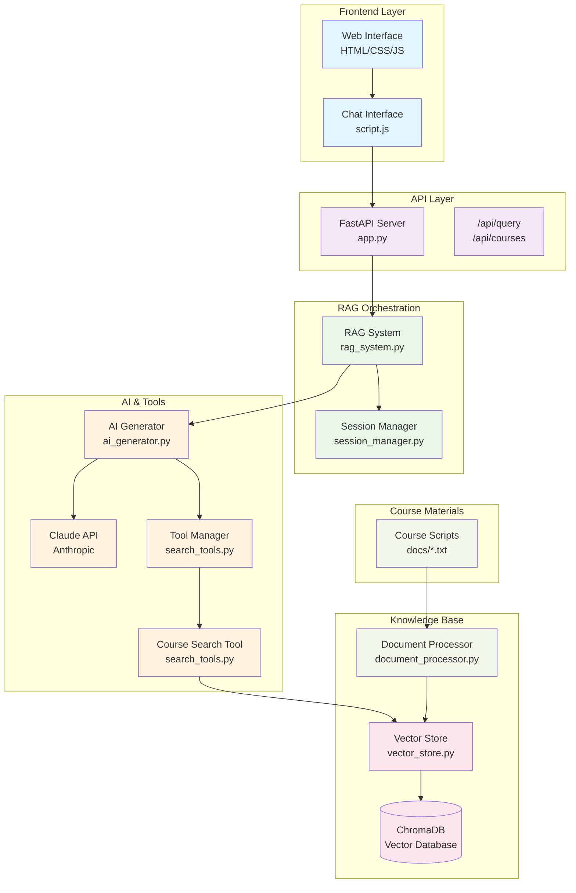

# RAG System Query Processing Flow

```mermaid
sequenceDiagram
    participant User
    participant Frontend as Frontend<br/>(script.js)
    participant FastAPI as FastAPI Server<br/>(app.py)
    participant RAGSystem as RAG System<br/>(rag_system.py)
    participant SessionMgr as Session Manager<br/>(session_manager.py)
    participant AIGen as AI Generator<br/>(ai_generator.py)
    participant Claude as Claude API<br/>(Anthropic)
    participant ToolMgr as Tool Manager<br/>(search_tools.py)
    participant SearchTool as Course Search Tool<br/>(search_tools.py)
    participant VectorStore as Vector Store<br/>(vector_store.py)
    participant ChromaDB as ChromaDB<br/>(Database)

    User->>+Frontend: Types query & clicks send
    
    Frontend->>Frontend: Disable input, show loading
    Frontend->>+FastAPI: POST /api/query<br/>{query, session_id}
    
    FastAPI->>+RAGSystem: query(query, session_id)
    
    RAGSystem->>+SessionMgr: get_conversation_history(session_id)
    SessionMgr-->>-RAGSystem: Previous messages context
    
    RAGSystem->>RAGSystem: Create enhanced prompt:<br/>"Answer question about course materials: {query}"
    
    RAGSystem->>+AIGen: generate_response(prompt, history, tools, tool_manager)
    
    AIGen->>AIGen: Build API params with tools
    AIGen->>+Claude: messages.create()<br/>with tool definitions
    
    Note over Claude: Claude analyzes query<br/>Decides if search needed
    
    alt Claude decides to use search tool
        Claude-->>-AIGen: Response with tool_use:<br/>search_course_content
        
        AIGen->>+ToolMgr: execute_tool("search_course_content", query, course_name, lesson_number)
        ToolMgr->>+SearchTool: execute(query, filters)
        
        SearchTool->>+VectorStore: search(query, course_name, lesson_number)
        VectorStore->>VectorStore: Convert query to embeddings
        VectorStore->>+ChromaDB: Query with semantic similarity
        ChromaDB-->>-VectorStore: Ranked chunks with metadata
        VectorStore-->>-SearchTool: SearchResults object
        
        SearchTool->>SearchTool: Format results:<br/>[Course - Lesson X]<br/>Content chunk
        SearchTool->>SearchTool: Store sources for UI
        SearchTool-->>-ToolMgr: Formatted search results
        ToolMgr-->>-AIGen: Tool execution results
        
        AIGen->>+Claude: Second API call<br/>with tool results
        Claude-->>-AIGen: Final answer using search context
    else Claude uses general knowledge
        Claude-->>-AIGen: Direct response without tools
    end
    
    AIGen-->>-RAGSystem: Generated response
    
    RAGSystem->>+ToolMgr: get_last_sources()
    ToolMgr-->>-RAGSystem: Source list for UI
    
    RAGSystem->>+SessionMgr: add_exchange(session_id, query, response)
    SessionMgr-->>-RAGSystem: Updated conversation
    
    RAGSystem-->>-FastAPI: (response, sources)
    
    FastAPI-->>-Frontend: JSON: {answer, sources, session_id}
    
    Frontend->>Frontend: Remove loading message
    Frontend->>Frontend: Display answer with sources
    Frontend->>Frontend: Re-enable input
    Frontend-->>-User: Chat updated with response

    Note over User, ChromaDB: Key Components:
    Note over User, ChromaDB: • Tool-based search decisions by Claude
    Note over User, ChromaDB: • Session-based conversation history
    Note over User, ChromaDB: • Semantic vector search in ChromaDB
    Note over User, ChromaDB: • Source tracking for UI references
    Note over User, ChromaDB: • Error handling at each layer
```

## Architecture Overview



## Data Flow Summary

1. **User Input** → Frontend captures query
2. **HTTP Request** → FastAPI receives query + session
3. **RAG Orchestration** → System coordinates components
4. **AI Decision** → Claude decides whether to search
5. **Tool Execution** → Search tool queries vector store
6. **Vector Search** → ChromaDB returns relevant chunks
7. **Context Integration** → Claude generates response with context
8. **Response Delivery** → Answer + sources returned to user

The system uses Claude's tool-calling capabilities to intelligently determine when course-specific searches are needed versus general knowledge responses.